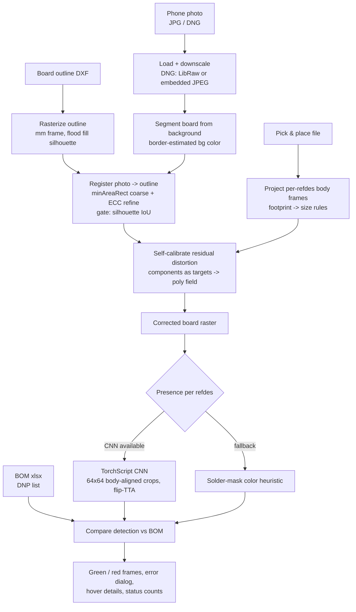
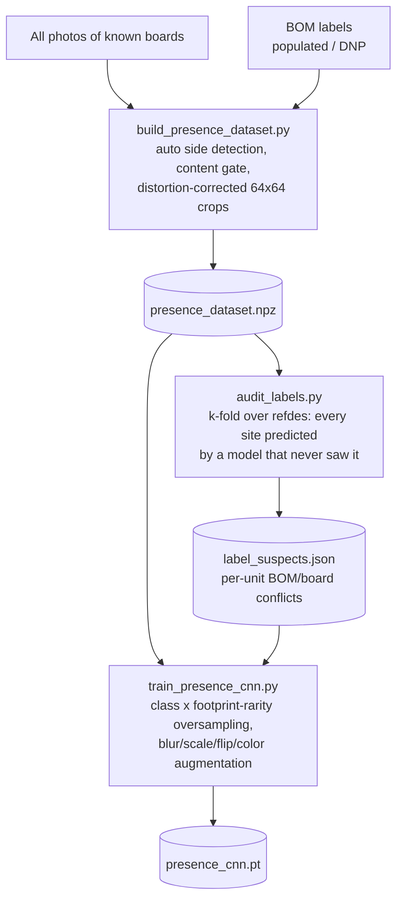

# How it works

Phone-photo AOI: detect assembly defects (missing / unexpected components) on a
populated PCB from handheld smartphone photos, by registering every photo into
the board's design coordinate frame and comparing each known component position
against the BOM.

The core idea: **the photo is just an unusual capture device**. Once the image
is mapped into the pick-and-place coordinate frame, every refdes becomes an
addressable region of interest — inspection happens at known locations, never
by blind object detection.

## Inspection flow



## Stage details

### 1. Board outline (`overlay_tool/outline.py`)

The DXF outline (lines / arcs / circles / polylines) is sampled into segments
in board millimeters and rasterized: segments drawn 1 px, background
flood-filled from the padded border, silhouette = everything not reached.
This gives both the display geometry and the binary mask used as the
registration target. All geometry stays in mm; pixels appear only at the
raster boundary.

### 2. Photo loading (`overlay_tool/register.py`)

JPG/PNG load via OpenCV. DNG loads via LibRaw (rawpy); Samsung's compressed
DNGs cannot be unpacked by LibRaw, so the embedded full-size JPEG preview is
used instead — plenty of resolution for inspection. Photos are downscaled to
a working size for segmentation/registration; the full-resolution image is
re-used later for per-component crops.

### 3. Background segmentation

The background color is estimated from the image border (the board never
touches the frame edge). Two classifier paths:

- **neutral backdrop** (gray/black fabric): the board is brighter and more
  saturated — union of Otsu splits on HSV value and saturation;
- **colored backdrop** (e.g. blue plastic): per-pixel **chroma-only** (a,b)
  distance to the border color, thresholded by the border's own distance
  spread. Chroma is used because lightness varies with vignetting and
  shadows; a fixed Otsu split fails when the board itself has two appearance
  modes (green mask vs gold pour).

Thin appendages (attached wires) are stripped by erode → keep main blob →
dilate → intersect.

### 4. Registration

The board silhouette is matched to the outline silhouette:

1. `minAreaRect` corners of both masks give 4 rotation candidates
   (× mirror for bottom-side photos — dictated by the declared side, never
   guessed, because a near-symmetric outline makes the wrong mirror score
   almost as well);
2. each candidate is refined with ECC homography on Gaussian-blurred
   silhouettes, coarse-to-fine (σ 12 → 3), best silhouette IoU wins;
3. **gate**: the final IoU is reported and the UI warns below 0.90. No
   measurement is trusted from a bad registration.

### 5. Distortion self-calibration (`overlay_tool/distortion.py`)

A single homography cannot absorb phone-lens radial distortion or board
flex — component frames drift off their parts toward the frame edges
(measured up to ~0.9 mm). The components themselves are used as a dense
calibration target:

1. every populated part is located by template-matching against the median
   template of its footprint group *from the same photo* → per-part offset
   vector in board mm;
2. a degree-3 polynomial offset field is robust-fitted (iterative trimming
   rejects bad matches and real placement outliers);
3. the board raster is remapped by the field.

Median frame-to-part offset drops from ~0.22 mm to ~0.05 mm, verified by
re-measuring on the corrected raster. Estimated per photo at inspection
time — no checkerboard, no calibration shots.

### 6. Footprint size rules (`overlay_tool/pnp.py`)

Body rectangles come from the footprint name via a rule chain:

1. explicit `WxH` dimensions in the name (`QFN-16_3X3MM`, `DFN-16_4x1.6`);
2. 4-digit chip codes — imperial from a table (`0402` → 1.0 × 0.5 mm),
   otherwise metric (`2016` → 2.0 × 1.6 mm); chip C/R/L bodies lie along Y
   at rotation 0 in this library;
3. a package table (SOT23, SC70, SOD-323, …) plus photo-measured entries;
4. fallback default, drawn dashed as "approximate".

Rotation convention: this Altium export gives bottom-side rotation CCW in
the top-view frame (no mirror negation) — verified against photos on the
only non-orthogonally-rotated part of the reference design.

### 7. Presence detection (`overlay_tool/presence.py`, `presence_cnn.py`)

Two backends behind the same button:

- **CNN** (preferred): a small 4-block TorchScript CNN over body-aligned
  64×64 RGB crops taken from the distortion-corrected raster, predictions
  averaged over 4 flips. Handles cases color rules cannot: parts whose top
  is itself a green PCB (interposer-mounted BGAs), translucent passives,
  tinned-but-empty pads.
- **color heuristic** (fallback, no torch needed): fraction of
  solder-mask-colored pixels inside the body frame (hue distance to the
  board's own mask color, estimated from the photo so white balance drops
  out).

### 8. Verdicts

With a BOM loaded (`overlay_tool/bom.py` parses the DNP list), each checked
position lands in one of four cases:

| BOM says | board shows | frame |
|---|---|---|
| populated | mounted | green |
| populated | not mounted | **red — missing** |
| DNP / not in BOM | empty | green |
| DNP / not in BOM | mounted | **red — unexpected** |

Mismatches raise an "Assembly errors found" dialog listing the refdes.
Without a BOM, the P&P "do not populate" comments serve as the DNP source.
Test points are excluded. Conflicts between BOM and P&P DNP markings are
reported as design-data errors (BOM wins).

## Training flow



Key points learned the hard way:

- **Label audit is mandatory.** Photographed units can genuinely lack
  BOM-required parts. Training on raw BOM labels makes the CNN memorize the
  wrong answer and the defect then passes as OK. The audit predicts every
  site with a model that never saw that site (k-fold over refdes), so a
  confident, photo-consistent disagreement with the BOM cannot hide behind
  memorization. Suspects are excluded from training — and double as an
  assembly report for the photographed unit.
- **Per-unit bookkeeping.** Different physical units differ in which parts
  are mounted; audit and exclusions are keyed by `unit:refdes` (unit =
  photo date prefix).
- **Rarity oversampling.** A board has hundreds of chip passives and a
  handful of odd packages; without footprint-rarity oversampling the odd
  ones stay underfitted and produce false "missing" verdicts.
- **Content gating.** A sibling board design with a near-identical outline
  registers fine (silhouette IoU ≈ 0.95) — only the warped-content
  correlation against a known reference photo exposes it.

## Module map

```
overlay_tool/
  app.py           Tkinter UI: plots, zoom/pan, presence button, verdicts
  outline.py       DXF -> segments + raster silhouette
  register.py      photo load, background segmentation, registration
  distortion.py    offset-field self-calibration, corrected raster, patches
  pnp.py           P&P parsing, footprint -> body size rules
  bom.py           BOM parsing, DNP list
  presence.py      color-heuristic presence + ROI extraction
  presence_cnn.py  CNN presence (TorchScript, optional torch dependency)
tools/
  build_presence_dataset.py   crops + labels from all photos
  audit_labels.py             k-fold label audit -> suspects
  train_presence_cnn.py       training -> golden/presence_cnn.pt
```

## Capture guidance

- Whole board in frame, shot as perpendicular as possible.
- Any roughly uniform backdrop; matte is better than glossy.
- The highest-resolution camera mode pays off directly: presence accuracy
  on 0201/0402 parts is limited by pixels per part.
- Several photos of the same board are all usable — for training they are
  free augmentation; for inspection, prefer the sharpest.
